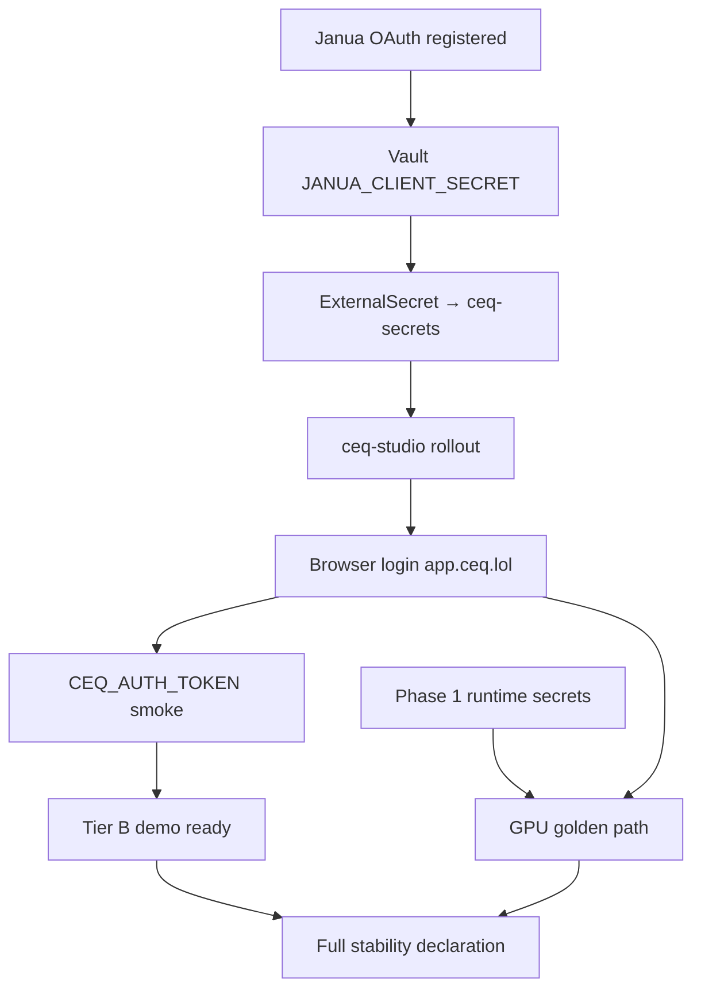

# CEQ Identity & Capped GA Demo — Session Wrap-Up

> **Last updated:** 2026-05-23  
> **Audience:** Engineering, operators, platform agents, stakeholders  
> **Status:** Engineering complete for identity wiring; operator gates open for Vault sync + browser proof  
> **Readiness:** ~72% to capped GA demo ([`GA_DEMO_DEFINITION.md`](./GA_DEMO_DEFINITION.md))

This document consolidates the 2026-05-22/23 stabilization session: what was
built, what Janua delivered, what operators must still run, and where every
detail lives.

---

## Executive summary

CEQ is **infra-stable** and **partially demoable** in production. Public edge,
API health, render pillar (auth-gated), host split, CI gates, and mocked auth
E2E are green. **Janua OAuth P0 is complete** — authorize returns 302 for client
`jnc_2EJwBz8xGVsGYOO2r3ck5CJH7YrQw4Yk`. **CEQ engineering wired K8s** to mount
`JANUA_CLIENT_SECRET` at runtime.

**Single remaining P0 for browser login:** sync `JANUA_CLIENT_SECRET` from
GitHub Actions repo secret → Vault `secret/ceq` → ExternalSecret → `ceq-studio`
pods, then verify login on `app.ceq.lol`.

After login works: Phase 1 runtime secrets → Phase 2 GPU golden-path smoke → Tier B
demo declaration.

---

## Documentation index

| Document | Purpose | Audience |
|----------|---------|----------|
| **[This file](./CEQ_IDENTITY_AND_DEMO_WRAPUP.md)** | Session wrap-up, doc map, status | Everyone |
| [`CEQ_STABILITY_ROADMAP.md`](./CEQ_STABILITY_ROADMAP.md) | Full P0–P7 program, smoke matrix, historical record | Eng + ops |
| [`GA_DEMO_DEFINITION.md`](./GA_DEMO_DEFINITION.md) | Capped GA demo tiers (A/B/C), scorecard, acceptance | Product + demo |
| [`JANUA_AGENT_HANDOFF.md`](./JANUA_AGENT_HANDOFF.md) | Janua OAuth contract (**P0 done**) | Janua agents |
| [`JANUA_OPERATOR.md`](./JANUA_OPERATOR.md) | CEQ-side operator checklist (Vault, browser, smokes) | CEQ on-call |
| [`PLATFORM_AGENT_HANDOFFS.md`](./PLATFORM_AGENT_HANDOFFS.md) | Copy-paste prompts: Vault, K8s, acceptance, deploy | Platform agents |
| [`PRODUCTION_DEPLOYMENT.md`](./PRODUCTION_DEPLOYMENT.md) | Deploy checklist, secrets template, CI gates | Operators |

---

## Engineering delivered (in-repo)

### Studio & auth

| Item | Location |
|------|----------|
| Docker entrypoint fix (`apps/studio/server.js`) | `apps/studio/Dockerfile` |
| Docker smoke script | `scripts/studio-docker-smoke.sh` |
| WebSocket session bootstrap | `apps/studio/src/lib/api.ts` — `resolveStreamAuthToken()` |
| Middleware `127.0.0.1` app host (Playwright/local) | `apps/studio/src/middleware.ts` |
| User menu a11y (`Account` / `Sign in`) | `apps/studio/src/components/layout/user-menu.tsx` |
| Playwright auth E2E (6 tests, mocked Janua) | `apps/studio/e2e/` |
| Mock Janua server | `apps/studio/e2e/mock-janua-server.mjs` |

### Kubernetes & secrets wiring

| Item | Location |
|------|----------|
| Studio `JANUA_CLIENT_SECRET` secretKeyRef | `infrastructure/k8s/studio-deployment.yaml` |
| ExternalSecret Vault mapping | `infrastructure/k8s/external-secret.yaml` |
| Secret template + client ID alignment | `infrastructure/k8s/secrets.yaml` |
| Vault sync helper script | `scripts/sync-janua-client-secret-to-vault.sh` |

### CI/CD

| Job | Workflow |
|-----|----------|
| Studio · Docker smoke | `.github/workflows/ci.yaml` |
| Studio · Playwright auth | `.github/workflows/ci.yaml` |
| Deploy waits for CI | `.github/workflows/deploy.yaml` |
| API/workers ruff gate fixes | `apps/api/pyproject.toml`, `apps/workers/pyproject.toml` |

### Test matrix (2026-05-23)

| Suite | Result |
|-------|--------|
| Studio Vitest | 88 passed |
| Studio Playwright (mock Janua) | 6/6 |
| Public prod smoke | Green |
| CEQ CI | Green on `aa4288b`+ |

---

## Janua deliverables (confirmed 2026-05-23)

| Field | Value |
|-------|-------|
| `client_id` | `jnc_2EJwBz8xGVsGYOO2r3ck5CJH7YrQw4Yk` (unchanged) |
| Client name (Janua) | `ceq-studio` |
| Grants | `authorization_code`, `refresh_token` |
| Scopes | `openid`, `profile`, `email` |
| Redirect URIs | `https://app.ceq.lol/auth/callback`, `http://localhost:5801/auth/callback`, `http://127.0.0.1:5801/auth/callback` |
| Audience | `ceq-api` |
| Issuer | `https://auth.madfam.io` |
| JWKS | `https://auth.madfam.io/.well-known/jwks.json` (RS256, `kid=janua-primary-key`) |

**Janua verification:**

- Authorize → **302** (not `invalid_client`)
- Token with bogus code → **`invalid_grant`** (client credentials accepted)
- JWKS / issuer → OK
- `GET /logout` → **404** (P1; login unblocked)

**Credentials:** `JANUA_CLIENT_SECRET` stored as GitHub Actions secret on
`madfam-org/ceq` (2026-05-23). **Never commit to git.**

---

## Operator gates (open)

Execute in order. Full prompts: [`PLATFORM_AGENT_HANDOFFS.md`](./PLATFORM_AGENT_HANDOFFS.md).

| # | Agent | Action | Blocker for | 2026-05-23 status |
|---|-------|--------|-------------|-------------------|
| 1 | Enclii/Vault | Write `JANUA_CLIENT_SECRET` to Vault `secret/ceq` | Token exchange | ❌ **Not synced** — key absent from `ceq-secrets` |
| 2 | Platform/K8s | ExternalSecret sync + `ceq-studio` rollout | Pod env | ⏸ After Agent 1 |
| 3 | CEQ acceptance | Browser login + `production-smoke.sh` with JWT | Tier B demo | ⏸ Public smoke only |
| 4 | Janua (P1) | Deploy `GET /logout` fix | Sign-out redirect | 🔧 Code in `janua`; prod 404 |
| 5 | CEQ deploy | Monitor GitOps digest deploy | Latest images | Ongoing |
| 6 | Phase 1 secrets | `JOB_COMPLETION_CALLBACK_TOKEN`, webhook secret | GPU smoke | Open |
| 7 | GitHub org | Branch protection on `main` | CI governance | Open |

**Coordinator run (2026-05-23):** Confirmed GitHub repo secret exists; Vault property not
materialized in cluster; `CEQ_PUBLIC_ONLY=true` production smoke green; Janua authorize 302.
See [`PLATFORM_AGENT_HANDOFFS.md`](./PLATFORM_AGENT_HANDOFFS.md) § Coordinator session outcomes.

### Quick operator commands

```bash
# 1. Vault sync (operator with Vault auth; paste secret at prompt)
scripts/sync-janua-client-secret-to-vault.sh

# 2. K8s verify (break-glass)
kubectl -n ceq get externalsecret ceq-secrets
kubectl -n ceq rollout restart deployment/ceq-studio
kubectl -n ceq rollout status deployment/ceq-studio --timeout=300s

# 3. Public smoke (no credentials)
CEQ_PUBLIC_ONLY=true scripts/production-smoke.sh

# 4. Post-login smoke
export CEQ_AUTH_TOKEN='<jwt-from-session>'
CEQ_RUN_OPERATIONS_STATUS=true scripts/production-smoke.sh
```

---

## Critical path diagram



---

## Production hosts

| Host | Role |
|------|------|
| `ceq.lol` | Marketing / landing |
| `app.ceq.lol` | Authenticated Studio (OAuth callback here) |
| `api.ceq.lol` | FastAPI + Janua JWT validation |
| `ws.ceq.lol` | Job WebSocket streams |
| `auth.madfam.io` | Janua OIDC |

OAuth callback **must** be `https://app.ceq.lol/auth/callback` (not `ceq.lol`).

---

## Key commits (2026-05-22/23)

| Commit | Summary |
|--------|---------|
| `b47cca8` | Studio E2E, Docker entrypoint, CI gates, WebSocket bootstrap |
| `eb34d2d` | GA demo definition + Janua agent handoff docs |
| `bcf0b6b` | K8s Studio secret mount + Janua P0 status docs |
| `aa4288b` | CI ruff fixes (API + workers) |
| `b2aebb0` | Platform agent handoffs doc |

---

## Definition of done

### Tier B capped GA demo

- [x] Janua authorize 302 for documented client
- [x] K8s manifests wire `JANUA_CLIENT_SECRET`
- [x] CI green (unit + Playwright mock + Docker smoke)
- [ ] Vault `secret/ceq.JANUA_CLIENT_SECRET` synced
- [ ] `ceq-studio` pods have secret env
- [ ] Real browser login on `app.ceq.lol`
- [ ] `CEQ_AUTH_TOKEN` production smoke green
- [ ] Tier B checklist in `GA_DEMO_DEFINITION.md` ticked

### Full stability

All Tier B items plus Phase 1–3 gates in
[`CEQ_STABILITY_ROADMAP.md`](./CEQ_STABILITY_ROADMAP.md) § Definition of done.

---

## Enclii adapter gaps to record

| Gap | Break-glass | Follow-up |
|-----|-------------|-----------|
| GitHub → Vault sync for Janua secret | Vault CLI / `sync-janua-client-secret-to-vault.sh` | Enclii secrets adapter |
| Cluster verify / rollout | `ssh.madfam.io` + kubectl | Enclii deploy API |
| Janua logout route | Janua deploy | OIDC end-session endpoint |

---

## Related repo entrypoints

- Agent instructions: [`AGENTS.md`](../AGENTS.md)
- LLM index: [`llms.txt`](../llms.txt), [`llms-full.txt`](../llms-full.txt)
- Ecosystem context: [`ECOSYSTEM.md`](../ECOSYSTEM.md)

---

*Session wrap-up — identity & capped GA demo track. Update this file when Tier B
gates close or full stability is declared.*
