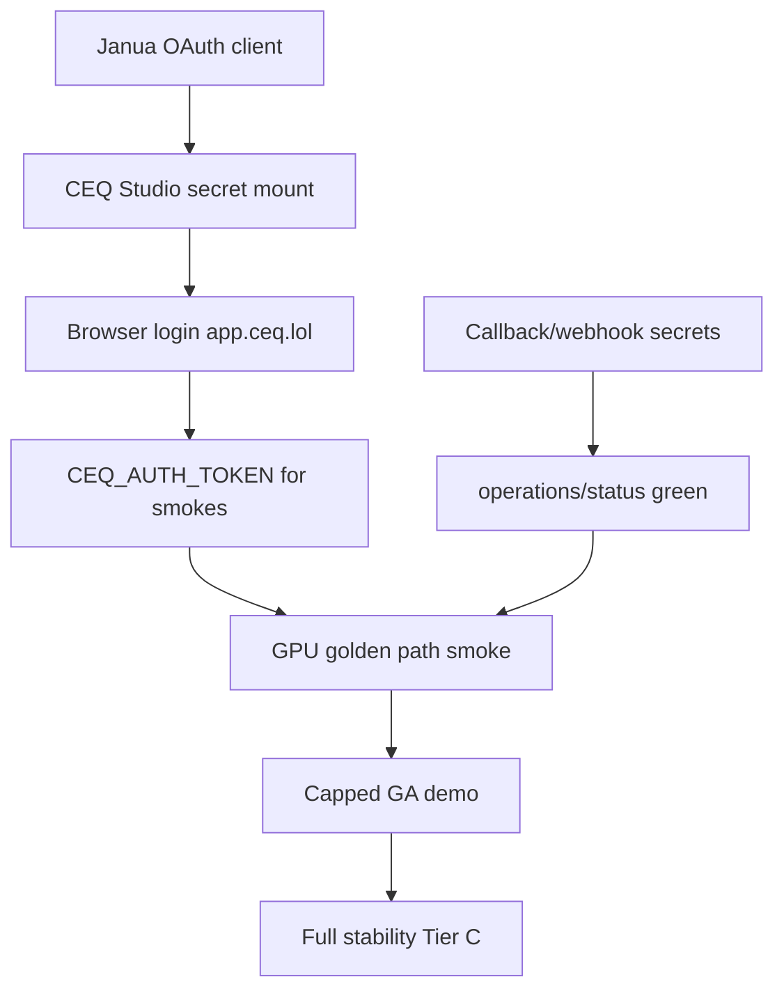

# CEQ Capped GA Demo — Definition and Readiness

> **Last updated:** 2026-05-23  
> **Audience:** Product, engineering, operators, demo presenters  
> **Related:** [`CEQ_IDENTITY_AND_DEMO_WRAPUP.md`](./CEQ_IDENTITY_AND_DEMO_WRAPUP.md), [`CEQ_STABILITY_ROADMAP.md`](./CEQ_STABILITY_ROADMAP.md), [`JANUA_OPERATOR.md`](./JANUA_OPERATOR.md), [`JANUA_AGENT_HANDOFF.md`](./JANUA_AGENT_HANDOFF.md), [`PLATFORM_AGENT_HANDOFFS.md`](./PLATFORM_AGENT_HANDOFFS.md)

---

## Executive summary

CEQ is **infra-stable and partially demoable in production today**. A **capped,
prod-quality GA demo** (real login, one golden GPU path, deterministic render
API, InterestGate caps) is approximately **72% complete**.

| Milestone | Readiness | Blocker |
|-----------|-----------|---------|
| Public marketing + API edge | **~90%** | None |
| Asset pillar (`/v1/render/*`, `@ceq/sdk`) | **~90%** | Needs Janua JWT for live call |
| Authenticated Studio (`app.ceq.lol`) | **~50%** | Janua registered; CEQ secret mount + browser proof pending |
| End-to-end GPU job in prod | **~10%** | Janua + runtime secrets + prod smokes |
| Capped monetization (InterestGate) | **~40%** | Code shipped; Tulana pricing low confidence |
| GA ops (strict smoke, alerts, branch protection) | **~30%** | Operator + org-admin actions |

**Critical path:** ~~Janua OAuth registration~~ ✅ (2026-05-23) → **CEQ Vault sync +
Studio rollout** → runtime secrets verified → one authenticated GPU smoke green.

**Estimated calendar time after Vault sync + Studio rollout:** **~1 week** for
capped GA demo; **~2 weeks** for full stability declaration per roadmap.

---

## What “capped GA demo” means

A **capped GA demo** is production-hosted, contract-tested, and presentable to
external stakeholders **without** claiming full PRD breadth. Caps are intentional:

| Cap type | Mechanism | Status |
|----------|-----------|--------|
| **Identity** | Janua SSO; demo accounts only | Janua registered; CEQ secret sync pending |
| **GPU throughput** | Single “golden” template + Vast.ai capacity | Not prod-proven |
| **Templates** | 6 seeded workflows; demo uses 1 image path | Seeded; smoke TBD |
| **Monetization** | InterestGate on pro/premium tags (not checkout) | Shipped in code |
| **Render API** | Auth-gated; deterministic R2 cache | Shipped |
| **Publishing** | Webhook only; social channels `coming_soon` | Out of demo scope |
| **OpenAPI** | Disabled in production | Enforced |

**GA quality bar** for this demo means:

- No manual `kubectl apply` for routine deploys (GitOps + CI gates)
- Public smoke green on every release candidate
- Real browser login and session cookies on `app.ceq.lol`
- At least one job: submit → queue → worker → R2 → callback → PostgreSQL → gallery
- Documented operator runbooks and smoke commands
- No known P0 infra regressions (502, selector mismatch, Studio crashloop)

**Not required** for capped GA demo: full template catalog, Furnace migration,
multi-channel publishing, paid checkout, or full observability on-call proof.

---

## Readiness scorecard (2026-05-23)

```
Public / infra / render API     ████████████████████  ~90%
CI & deploy safety              ████████████████░░░░  ~80%
Authenticated Studio UX         ████░░░░░░░░░░░░░░░░  ~20%
End-to-end GPU in prod          ██░░░░░░░░░░░░░░░░░░  ~10%
Capped monetization (InterestGate) ████████░░░░░░░░  ~40%
GA ops (alerts, strict smoke)   ██████░░░░░░░░░░░░░░  ~30%
```

### Live production evidence (re-verified 2026-05-23)

| Check | Result |
|-------|--------|
| `CEQ_PUBLIC_ONLY=true scripts/production-smoke.sh` | Green |
| `https://ceq.lol` | HTTP 200 (marketing) |
| `https://api.ceq.lol/health` | `status: ok` |
| `https://app.ceq.lol/` (no session) | 307 → login |
| `POST /v1/render/card` (no auth) | 401 |
| Janua authorize for documented client | 302 → login (registered 2026-05-23) |

### Engineering gates landed (2026-05-22 commit `b47cca8`)

- Studio Docker entrypoint fix + `scripts/studio-docker-smoke.sh`
- CI: `Studio · Docker smoke`, `Studio · Playwright auth` (mocked Janua, 6 tests)
- Deploy workflow waits for CI before image push
- WebSocket auth via `resolveStreamAuthToken()` + session bootstrap
- Middleware: `127.0.0.1` treated as app host (E2E + local dev)

---

## Demo tiers

### Tier A — Demoable today (no further code)

**Audience:** Technical buyers, ecosystem partners, API integrators.

**Narrative:** “CEQ asset pillar + live infra.”

| Step | Action | Proof |
|------|--------|-------|
| 1 | Open [ceq.lol](https://ceq.lol) | Marketing landing, host split |
| 2 | Show `curl https://api.ceq.lol/health` | API live |
| 3 | Show render 401 without auth | Security posture |
| 4 | `POST /v1/render/card` with Janua JWT (or service account) | Deterministic URL from R2 |
| 5 | Reference `@ceq/sdk` + stratum-tcg consumer | Ecosystem story |

**Limitation:** No interactive Studio login; no GPU job walkthrough.

---

### Tier B — Capped GA demo (target)

**Audience:** Prospects, internal stakeholders, GA announcement.

**Narrative:** “Sign in → run one workflow → see output in gallery (+ optional render API).”

**Prerequisites:**

1. Phase 0 — Janua OAuth client live ✅ (2026-05-23) + CEQ Vault sync + Studio rollout
2. CEQ wires `JANUA_CLIENT_SECRET` into Studio deployment (see handoff § CEQ follow-up)
3. Phase 1 — `operations/status` green (callback + webhook secrets)
4. Phase 2 — one `CEQ_STRICT_SMOKE` golden path

**Demo script (15–20 min):**

1. **Landing** — `ceq.lol` → positioning, link to Studio.
2. **Login** — `app.ceq.lol` → Janua → return to Studio shell (“Signal acquired.”).
3. **Workflow** — Open seeded image template → Run → Queue monitor shows progress.
4. **Output** — Gallery shows completed asset from R2.
5. **Render pillar (optional)** — Same card via `POST /v1/render/card` or SDK; show stable URL.
6. **Cap story** — Premium template shows InterestGate overlay (not paywall checkout).

**Acceptance:** All items in [Tier B checklist](#tier-b-acceptance-checklist) checked.

---

### Tier C — Full stability / GA (uncapped ops)

**Audience:** Production on-call, compliance, scale.

Adds: cancel smoke, multi-modal template smokes, alert routing, branch protection,
`CEQ_STRICT_SMOKE` full matrix, stability declaration in roadmap.

See [`CEQ_STABILITY_ROADMAP.md` § Definition of done](./CEQ_STABILITY_ROADMAP.md#definition-of-done--full-stability).

---

## Tier B acceptance checklist

### Identity (Phase 0)

- [x] Janua returns no `invalid_client` for `jnc_2EJwBz8xGVsGYOO2r3ck5CJH7YrQw4Yk` (302 authorize, 2026-05-23)
- [ ] Browser login on `app.ceq.lol` completes OAuth callback (needs Vault secret + Studio rollout)
- [ ] `GET /api/auth/session` returns `user` + `access_token` with session cookies
- [ ] Logout clears CEQ cookies and completes Janua post-logout redirect
- [ ] Studio `env`: `JANUA_CLIENT_SECRET` mounted at runtime (not only at build)

### Runtime secrets (Phase 1)

- [ ] `JOB_COMPLETION_CALLBACK_TOKEN` and `JOB_WEBHOOK_SECRET` in `ceq-secrets`
- [ ] `GET /v1/operations/status` reports callback + webhook ready
- [ ] Alembic head `20260514_outputs_job_storage_unique` applied

### GPU golden path (Phase 2)

- [ ] Worker pods running; Vast.ai (or configured provider) reachable
- [ ] Submit job via Studio or API with Janua JWT
- [ ] Job reaches `completed`; output in gallery
- [ ] Completion dead-letter depth = 0

### Automated proof

```bash
# Public (always)
CEQ_PUBLIC_ONLY=true scripts/production-smoke.sh

# After Janua login — extract JWT from browser session or Janua token endpoint
export CEQ_AUTH_TOKEN='<janua-access-jwt>'
export CEQ_ADMIN_AUTH_TOKEN="${CEQ_AUTH_TOKEN}"
export CEQ_TEMPLATE_ID='<seeded-image-template-uuid>'

CEQ_RUN_OPERATIONS_STATUS=true \
CEQ_REQUIRE_OPERATIONS_STATUS=true \
scripts/production-smoke.sh

# Capped GA gate (single template + operations; add cancel for Tier C)
CEQ_STRICT_SMOKE=true \
CEQ_AUTH_TOKEN="$CEQ_AUTH_TOKEN" \
CEQ_TEMPLATE_ID="$CEQ_TEMPLATE_ID" \
scripts/production-smoke.sh
```

### CI regression (no prod credentials)

```bash
cd apps/studio && CI=true pnpm test:e2e          # 6 Playwright auth tests
bash scripts/studio-docker-smoke.sh <image>   # Docker entrypoint
```

---

## Smoke matrix quick reference

| Scenario | Flags |
|----------|-------|
| Public edge only | `CEQ_PUBLIC_ONLY=true` |
| Operations readiness | `CEQ_RUN_OPERATIONS_STATUS=true CEQ_REQUIRE_OPERATIONS_STATUS=true CEQ_ADMIN_AUTH_TOKEN=…` |
| Capped GA (minimal) | `CEQ_AUTH_TOKEN=… CEQ_TEMPLATE_ID=…` + operations flags |
| Full strict gate | `CEQ_STRICT_SMOKE=true` (+ cancel + multi-modal JSON) |

Full matrix: [`CEQ_STABILITY_ROADMAP.md` § Smoke matrix](./CEQ_STABILITY_ROADMAP.md#smoke-matrix-operator-quick-reference).

---

## Timeline (from Janua unblock)

| Day | Focus | Exit |
|-----|-------|------|
| D0 | CEQ: Vault sync + ArgoCD Studio rollout | Token exchange 200 |
| D1 | Browser acceptance + `CEQ_AUTH_TOKEN` smoke | Tier B identity ✅ |
| D1 | Phase 1 secrets + `operations/status` | Callback/webhook green |
| D2–4 | Phase 2 golden GPU smoke | Gallery output in prod |
| D5 | Tier B demo rehearsal + InterestGate check | Capped GA demo ready |
| W2–3 | Tier C (optional) | Full stability declaration |

---

## Explicit non-goals (capped demo)

- Full PRD template catalog (dozens of workflows)
- Twitter/Instagram/LinkedIn/Discord publishing
- Furnace GPU scheduler (Vast.ai is current provider)
- Paid checkout / Tulana billing integration
- `synthesis` / `intent` / `printability` intelligence APIs
- Redis Sentinel migration
- Staging environment parity proof

Track these in roadmap Phase 7 backlog.

---

## Dependency map



---

## Presenter FAQ

**Can we demo without Janua?**  
Yes — Tier A only (landing + render API with a pre-issued JWT).

**Why app.ceq.lol and not ceq.lol for login?**  
Host split: marketing on `ceq.lol`, authenticated app on `app.ceq.lol`. OAuth
callback must be `https://app.ceq.lol/auth/callback`.

**Is CI enough to trust auth?**  
Playwright uses mocked Janua; it guards regressions but does not replace live
Janua registration.

**What’s the fastest unblock?**  
Dispatch [`PLATFORM_AGENT_HANDOFFS.md`](./PLATFORM_AGENT_HANDOFFS.md) — Vault sync (Agent 1) then K8s rollout (Agent 2).

---

## Related documents

| Document | Purpose |
|----------|---------|
| [`CEQ_STABILITY_ROADMAP.md`](./CEQ_STABILITY_ROADMAP.md) | Full P0–P7 phases and stability declaration |
| [`JANUA_OPERATOR.md`](./JANUA_OPERATOR.md) | CEQ-side operator checklist |
| [`JANUA_AGENT_HANDOFF.md`](./JANUA_AGENT_HANDOFF.md) | Janua-repo agent complete handoff |
| [`PRODUCTION_DEPLOYMENT.md`](./PRODUCTION_DEPLOYMENT.md) | Deploy and secrets |
| [`apps/api/README.md`](../apps/api/README.md) | Render API contract |
| [`packages/sdk/README.md`](../packages/sdk/README.md) | `@ceq/sdk` consumer docs |
