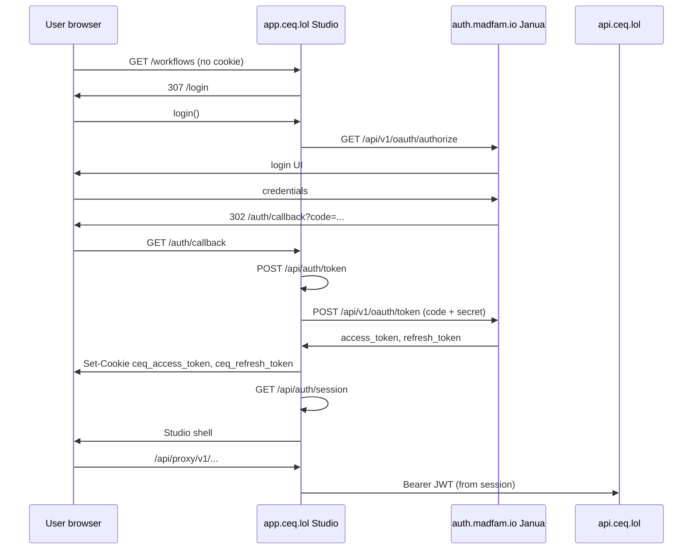

# Janua Agent Handoff — CEQ Studio OAuth Integration

> **Last updated:** 2026-05-23  
> **From:** CEQ (`madfam-org/ceq`)  
> **To:** Janua agent / Janua operator / Enclii identity adapter owner  
> **Priority:** P0 — blocks all authenticated CEQ value and capped GA demo  
> **CEQ operator mirror:** [`JANUA_OPERATOR.md`](./JANUA_OPERATOR.md)  
> **Platform agents:** [`PLATFORM_AGENT_HANDOFFS.md`](./PLATFORM_AGENT_HANDOFFS.md)  
> **Session wrap-up:** [`CEQ_IDENTITY_AND_DEMO_WRAPUP.md`](./CEQ_IDENTITY_AND_DEMO_WRAPUP.md)  
> **Demo context:** [`GA_DEMO_DEFINITION.md`](./GA_DEMO_DEFINITION.md)

---

## Janua-side completion (2026-05-23)

Janua P0 is **complete**. OAuth client `jnc_2EJwBz8xGVsGYOO2r3ck5CJH7YrQw4Yk`
is registered. CEQ-side wiring (Vault → ExternalSecret → Studio deployment)
is tracked in [`JANUA_OPERATOR.md`](./JANUA_OPERATOR.md).

**Known follow-up (non-blocking for login):** `GET /logout` on `auth.madfam.io`
returns 404 — sign-out redirect may need Janua route fix (P1).

---

## 1. Mission for the Janua-side agent

Register and verify an OAuth 2.0 / OIDC **confidential or public+secret**
client so **CEQ Studio** (`https://app.ceq.lol`) can complete the
authorization code flow with refresh tokens. Today Janua returns:

```json
{
  "error": "invalid_client",
  "error_description": "invalid_client: Unknown client_id"
}
```

for client ID `jnc_2EJwBz8xGVsGYOO2r3ck5CJH7YrQw4Yk`.

**Success criteria:** A real user can log in on `app.ceq.lol`, receive Janua
access/refresh tokens via CEQ server routes, and call `api.ceq.lol` with the
issued JWT.

---

## 2. Consumer system summary (CEQ)

| Property | Value |
|----------|-------|
| **Product** | CEQ — Creative Entropy Quantized |
| **Repo** | `github.com/madfam-org/ceq` |
| **Public marketing** | `https://ceq.lol` |
| **Authenticated app** | `https://app.ceq.lol` (Next.js 14 Studio) |
| **API** | `https://api.ceq.lol` (FastAPI, validates Janua JWTs) |
| **WebSocket** | `wss://ws.ceq.lol` (job streams; bearer in query today) |
| **Namespace** | Kubernetes `ceq` on Enclii k3s |
| **Auth model** | OIDC via Janua; Studio uses httpOnly session cookies; API uses `Authorization: Bearer` |

CEQ does **not** implement its own user store for Studio login. Janua is the
sole identity provider for human users.

---

## 3. Required OAuth client registration

### 3.1 Preferred: re-register existing client ID

Reuse the ID already baked into CEQ builds and docs to avoid a coordinated
rotation across GitHub vars, K8s secrets, and ArgoCD.

| Field | Value |
|-------|-------|
| **Client display name** | `CEQ Studio` |
| **Client ID** | `jnc_2EJwBz8xGVsGYOO2r3ck5CJH7YrQw4Yk` |
| **Client type** | Confidential (CEQ server holds `client_secret`) |
| **Grant types** | `authorization_code`, `refresh_token` |
| **Response type** | `code` |
| **Scopes** | `openid`, `profile`, `email` |

### 3.2 Redirect URIs (exact match required)

| Environment | Redirect URI |
|-------------|--------------|
| **Production** | `https://app.ceq.lol/auth/callback` |
| **Development** | `http://localhost:5801/auth/callback` |
| **Playwright E2E** | `http://127.0.0.1:5801/auth/callback` (local CI only) |

**Do not** register `https://ceq.lol/auth/callback` — marketing host does not
run the OAuth callback handler.

### 3.3 Post-logout redirect URIs

| Environment | URI |
|-------------|-----|
| Production | `https://app.ceq.lol/` |
| Development | `http://localhost:5801/` |
| Playwright | `http://127.0.0.1:5801/` |

Studio builds logout URL as:

```
GET {JANUA_URL}/logout?client_id={CLIENT_ID}&post_logout_redirect_uri={origin}/
```

### 3.4 Alternative: rotate client ID

If `jnc_2EJwBz8xGVsGYOO2r3ck5CJH7YrQw4Yk` cannot be restored, create a new
client and return to CEQ:

- New `client_id`
- New `client_secret`
- Confirmation of redirect URIs above

CEQ will update `CEQ_PUBLIC_JANUA_CLIENT_ID` (GitHub var), Docker build args,
and `JANUA_CLIENT_SECRET` in `ceq-secrets`, then redeploy Studio via GitOps.

---

## 4. Janua endpoints CEQ calls

Production issuer: **`https://auth.madfam.io`**

| Operation | Method | Path | Caller |
|-----------|--------|------|--------|
| Authorize (browser) | GET | `/api/v1/oauth/authorize` | Browser via Studio `login()` |
| Token (code exchange) | POST | `/api/v1/oauth/token` | Studio `POST /api/auth/token` |
| Token (refresh) | POST | `/api/v1/oauth/token` | Studio `GET /api/auth/session`, `POST /api/auth/refresh` |
| UserInfo (optional) | GET | `/api/v1/oauth/userinfo` | Studio client `validateToken()` |
| Logout (browser) | GET | `/logout` | Browser via Studio `logout()` |
| JWKS | GET | `/.well-known/jwks.json` | CEQ API token validation |

### 4.1 Authorization request (browser)

Example query parameters CEQ sends:

```
client_id=jnc_2EJwBz8xGVsGYOO2r3ck5CJH7YrQw4Yk
redirect_uri=https://app.ceq.lol/auth/callback
response_type=code
scope=openid profile email
state=/   # or sanitized in-app path, e.g. /workflows
```

### 4.2 Token exchange (server-side)

Studio route `POST /api/auth/token` forwards to Janua:

```
POST https://auth.madfam.io/api/v1/oauth/token
Content-Type: application/x-www-form-urlencoded

grant_type=authorization_code
code={authorization_code}
redirect_uri=https://app.ceq.lol/auth/callback   # derived from request Origin
client_id=jnc_2EJwBz8xGVsGYOO2r3ck5CJH7YrQw4Yk
client_secret={JANUA_CLIENT_SECRET}
```

**Janua must:**

- Accept `application/x-www-form-urlencoded` body
- Return JSON: `access_token`, `refresh_token`, `expires_in`, `token_type` (Bearer)
- Return OAuth error JSON on failure (`error`, `error_description`)

### 4.3 Refresh token grant

```
grant_type=refresh_token
refresh_token={refresh_token}
client_id=...
client_secret=...
```

Used when CEQ access cookie JWT is expired but refresh cookie exists
(`GET /api/auth/session`).

---

## 5. Access token claims CEQ expects

CEQ parses JWT payload **without local signature verification in Studio**
(session bootstrap only). The API validates signatures via JWKS.

Minimum claims for Studio UX:

| Claim | Required | Usage |
|-------|----------|-------|
| `sub` | Yes | User ID |
| `email` | Yes | Display + API identity |
| `name` | Recommended | Display name |
| `picture` | Optional | Avatar |
| `exp` | Yes | Expiry; refresh when within 60s skew |

Example payload shape:

```json
{
  "sub": "user-uuid",
  "email": "user@madfam.io",
  "name": "Display Name",
  "exp": 1735689600
}
```

**API (`api.ceq.lol`)** validates JWT against Janua JWKS. Ensure issued tokens
are valid for:

- Issuer: `https://auth.madfam.io` (see CEQ `JANUA_ISSUER_URL` in cluster)
- Audience / client policies as configured in Janua for CEQ

Cluster-internal Janua API (for reference, CEQ API side):

- `JANUA_API_URL`: `http://janua-api.janua.svc.cluster.local:4100`
- `JANUA_ISSUER_URL`: `https://auth.madfam.io`

---

## 6. End-to-end auth sequence



---

## 7. CEQ session cookies (for Janua awareness)

After successful token exchange, Studio sets:

| Cookie | Name | httpOnly | Purpose |
|--------|------|----------|---------|
| Access | `ceq_access_token` | yes | Janua access JWT |
| Refresh | `ceq_refresh_token` | yes | Janua refresh token |

Logout: `POST /api/auth/logout` clears cookies, then browser navigates to
Janua `/logout` with `post_logout_redirect_uri`.

Janua does not need to understand CEQ cookie names; only standard OAuth
codes and tokens.

---

## 8. Known configuration drift (action items)

### 8.1 Client ID naming in K8s template

`infrastructure/k8s/secrets.yaml` template lists:

```yaml
JANUA_CLIENT_ID: "ceq-studio"
```

Studio production build uses:

```
NEXT_PUBLIC_JANUA_CLIENT_ID=jnc_2EJwBz8xGVsGYOO2r3ck5CJH7YrQw4Yk
```

(from `.github/workflows/deploy.yaml` build args).

**Janua agent:** Register **`jnc_2EJwBz8xGVsGYOO2r3ck5CJH7YrQw4Yk`** as the
OAuth client ID. CEQ may align the API secret key name separately.

### 8.2 Studio runtime secret mount (CEQ — in repo; operator must sync Vault)

**Updated 2026-05-23:** Manifests wired in CEQ repo:

- `external-secret.yaml` — `JANUA_CLIENT_SECRET` from Vault `secret/ceq`
- `studio-deployment.yaml` — `secretKeyRef` → `JANUA_CLIENT_SECRET`

**Operator remaining steps:**

1. Copy `JANUA_CLIENT_SECRET` from GitHub Actions repo secret to Vault (never git).
2. Confirm ExternalSecret reconciled and Studio pods rolled via ArgoCD.
3. Run browser acceptance ([`JANUA_OPERATOR.md` §4](./JANUA_OPERATOR.md)).

Without Vault sync, authorize succeeds but token exchange fails (empty secret).

---

## 9. Verification — Janua agent runs these

### 9.1 Client exists (no browser)

```bash
CLIENT_ID="jnc_2EJwBz8xGVsGYOO2r3ck5CJH7YrQw4Yk"
REDIRECT="https%3A%2F%2Fapp.ceq.lol%2Fauth%2Fcallback"

curl -sS -o /dev/null -w "authorize_http=%{http_code}\n" \
  "https://auth.madfam.io/api/v1/oauth/authorize?client_id=${CLIENT_ID}&redirect_uri=${REDIRECT}&response_type=code&scope=openid+profile+email&state=%2F"
```

**Pass:** HTTP 302/303 to login, or 200 login page — **not** JSON
`invalid_client`.

### 9.2 Token endpoint accepts client credentials

With a one-time authorization `code` from manual browser login:

```bash
curl -sS -X POST "https://auth.madfam.io/api/v1/oauth/token" \
  -H "Content-Type: application/x-www-form-urlencoded" \
  --data-urlencode "grant_type=authorization_code" \
  --data-urlencode "code=${AUTH_CODE}" \
  --data-urlencode "redirect_uri=https://app.ceq.lol/auth/callback" \
  --data-urlencode "client_id=${CLIENT_ID}" \
  --data-urlencode "client_secret=${CLIENT_SECRET}"
```

**Pass:** HTTP 200 + `access_token` in JSON.

### 9.3 Refresh grant

```bash
curl -sS -X POST "https://auth.madfam.io/api/v1/oauth/token" \
  -H "Content-Type: application/x-www-form-urlencoded" \
  --data-urlencode "grant_type=refresh_token" \
  --data-urlencode "refresh_token=${REFRESH_TOKEN}" \
  --data-urlencode "client_id=${CLIENT_ID}" \
  --data-urlencode "client_secret=${CLIENT_SECRET}"
```

### 9.4 JWKS reachable

```bash
curl -sS "https://auth.madfam.io/.well-known/jwks.json" | head -c 200
```

CEQ API depends on this for `Authorization: Bearer` on protected routes.

### 9.5 Logout redirect

```bash
curl -sS -o /dev/null -w "%{http_code} %{redirect_url}\n" \
  "https://auth.madfam.io/logout?client_id=${CLIENT_ID}&post_logout_redirect_uri=https%3A%2F%2Fapp.ceq.lol%2F"
```

---

## 10. Handoff deliverables back to CEQ

When complete, provide CEQ operators (secure channel — **not** git):

| Deliverable | Format |
|-------------|--------|
| `client_id` | String (confirm `jnc_2EJw…` or new) |
| `client_secret` | One-time secret for `ceq-secrets` |
| Redirect URI confirmation | Screenshot or export |
| Test user | Optional demo account for GA rehearsal |
| JWKS / issuer confirmation | `https://auth.madfam.io` unchanged |
| Timestamp | When verified in production |

CEQ will then:

1. Update vault / `ceq-secrets`
2. Mount `JANUA_CLIENT_SECRET` on Studio deployment
3. Run browser acceptance ([`JANUA_OPERATOR.md` §4](./JANUA_OPERATOR.md))
4. Run `CEQ_AUTH_TOKEN=… scripts/production-smoke.sh`
5. Update [`GA_DEMO_DEFINITION.md`](./GA_DEMO_DEFINITION.md) Tier B checklist

---

## 11. Troubleshooting matrix (Janua-side)

| Symptom | Likely Janua cause | Fix |
|---------|-------------------|-----|
| `invalid_client` on authorize | Client missing or wrong ID | Register client §3 |
| `redirect_uri_mismatch` | URI not allowlisted | Add exact production callback |
| `invalid_grant` on token | Code expired or redirect mismatch | Align redirect_uri with authorize |
| `invalid_client` on token only | Wrong secret or public client misconfigured | Regenerate secret; mark confidential |
| Login works; API 401 | Token not valid for API audience/issuer | Align JWT issuer + JWKS with API config |
| Refresh fails | Refresh grant disabled | Enable `refresh_token` grant |

---

## 12. Security and compliance notes

- **Do not** commit `client_secret` to `madfam-org/ceq` or chat logs.
- CEQ Studio never exposes `client_secret` to the browser; only server routes use it.
- Production OpenAPI is disabled; OAuth is the primary human auth path.
- Record Enclii adapter gap if registration used break-glass Janua admin UI.

---

## 13. What Janua does NOT need to do

- Deploy CEQ workloads (Enclii / ArgoCD owns that)
- Configure Cloudflare tunnels
- Seed CEQ templates or GPU workers
- Implement CEQ `/api/auth/*` routes (already in `apps/studio`)
- Run CEQ Playwright tests (CEQ CI uses mocked Janua on port 5999)

---

## 14. CEQ code references (for Janua agents with repo access)

| File | Purpose |
|------|---------|
| `apps/studio/src/lib/auth.ts` | OIDC URL builder, `exchangeCodeForTokens`, session bootstrap |
| `apps/studio/src/app/api/auth/token/route.ts` | Server-side code exchange |
| `apps/studio/src/app/api/auth/session/route.ts` | Session + refresh |
| `apps/studio/src/app/api/auth/refresh/route.ts` | Refresh endpoint |
| `apps/studio/src/app/auth/callback/page.tsx` | Browser callback UX |
| `apps/studio/src/middleware.ts` | Host split + session gate |
| `apps/studio/e2e/auth.spec.ts` | CI auth regression (mock Janua) |
| `.github/workflows/deploy.yaml` | `NEXT_PUBLIC_JANUA_*` build args |
| `infrastructure/k8s/studio-deployment.yaml` | **Needs `JANUA_CLIENT_SECRET` mount** |
| `scripts/production-smoke.sh` | Post-login acceptance |

---

## 15. Enclii-first operations

Prefer Enclii identity/OAuth client provisioning when an adapter exists.
If break-glass Janua admin was used:

- **Gap:** Enclii does not yet provision Janua OAuth clients for CEQ Studio
- **Record:** Actor, date, client ID, in internal-devops incident/gap log
- **Follow-up:** Wire Enclii → Janua client CRUD; remove raw-admin from routine runbooks

---

## 16. Related CEQ documents

| Document | Role |
|----------|------|
| [`CEQ_IDENTITY_AND_DEMO_WRAPUP.md`](./CEQ_IDENTITY_AND_DEMO_WRAPUP.md) | Session wrap-up and doc index |
| [`JANUA_OPERATOR.md`](./JANUA_OPERATOR.md) | CEQ operator checklist after Janua delivers |
| [`GA_DEMO_DEFINITION.md`](./GA_DEMO_DEFINITION.md) | Capped GA demo scope and Tier B acceptance |
| [`CEQ_STABILITY_ROADMAP.md`](./CEQ_STABILITY_ROADMAP.md) | Phase 0–7 program plan |
| [`PRODUCTION_DEPLOYMENT.md`](./PRODUCTION_DEPLOYMENT.md) | Secrets and deploy |

---

*Handoff version: 2026-05-23 — CEQ commit `b47cca8` baseline.*
